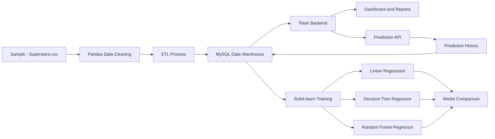

# Development of a Data-Driven Sales Prediction and Analysis Platform Using Data Warehousing and Data Mining

## Abstract

The project develops a data-driven sales prediction and analysis platform using Data Warehousing and Data Mining concepts. The system uses the `Sample - Superstore.csv` dataset to collect historical sales data, clean it, load it into a MySQL data warehouse, perform OLAP-style analysis, and train machine learning models for predictive analytics. The platform provides secure login and registration, a responsive analytics dashboard, real-time sales prediction, downloadable reports, and admin/user management. Linear Regression, Decision Tree Regressor, and Random Forest Regressor are trained and compared using regression metrics such as MAE, RMSE, and R2 score.

## Introduction

Modern businesses generate large volumes of transactional sales data from customers, products, categories, regions, and time periods. Raw transactional data is useful, but it becomes more valuable when transformed into a structured warehouse and analyzed using data mining methods. This project combines data warehousing and machine learning to help users understand sales performance and forecast sales from key business variables.

The platform demonstrates how DWDM concepts can be implemented in a practical full-stack system. Flask is used as the backend framework, MySQL stores operational and warehouse data, Pandas performs ETL and analytics, Scikit-learn trains prediction models, Matplotlib generates reports, and JavaScript charts display interactive dashboards.

## Literature Survey

Sales prediction and business intelligence have been widely studied in data mining and decision support systems. Traditional reporting systems summarize past transactions, while data warehousing improves reporting by storing clean, integrated, historical data in a query-friendly format. OLAP techniques help analysts slice and aggregate data by dimensions such as time, region, category, and product.

Machine learning improves business intelligence by identifying patterns from historical data and predicting future outcomes. Regression algorithms such as Linear Regression are simple and interpretable, while Decision Tree and Random Forest models can capture non-linear relationships. Prior studies in retail analytics show that combining warehouse-based reporting with predictive models improves planning, inventory management, and sales strategy.

## Existing System

In many small organizations, sales data is maintained in spreadsheets or basic transaction systems. These systems usually have the following limitations:

- Data is not cleaned or standardized.
- Reports must be created manually.
- Historical data is difficult to analyze across multiple dimensions.
- Sales forecasting is usually based on guesswork.
- Prediction history is not stored for future review.
- There is limited access control for admin and user roles.

## Proposed System

The proposed system is a complete web-based sales analytics and prediction platform. It collects sales records from the Superstore dataset, cleans and transforms the data, loads it into a MySQL warehouse, and provides dashboards and predictive analytics through a Flask application.

Key capabilities include:

- Secure login and registration
- Automatic ETL pipeline
- MySQL data warehouse
- OLAP-style dashboard analysis
- Regression model training and comparison
- Real-time sales prediction
- Prediction history storage
- CSV exports and downloadable reports
- Admin and user management

## Methodology

The project follows a DWDM workflow:

1. Data Collection
   The system uses `Sample - Superstore.csv` as the historical sales dataset.

2. Data Cleaning
   Pandas is used to remove duplicate records, parse dates, fill missing values, standardize column names, and convert numeric fields.

3. ETL Process
   The cleaned dataset is extracted from CSV, transformed into warehouse-ready records, and loaded into the MySQL `sales_records` table.

4. Data Warehouse
   MySQL stores sales facts, user accounts, model results, and prediction history. The sales table includes time attributes such as year, month, month name, and quarter for analysis.

5. OLAP-style Analysis
   The dashboard aggregates sales by month, region, category, and product. These views support business decision-making.

6. Data Mining
   The system trains regression models using `quantity`, `discount`, and `profit` as input features and `sales` as the target.

7. Predictive Analytics
   Users enter real-time values and receive a predicted sales amount. Each prediction is stored in MySQL.

## Architecture Diagram

## Algorithms Used

### Linear Regression

Linear Regression models the relationship between independent variables and a continuous target variable. In this project, it predicts sales from quantity, discount, and profit. It is easy to understand and provides a useful baseline.

### Decision Tree Regressor

Decision Tree Regressor splits data based on feature values and creates a tree-like prediction structure. It can capture non-linear behavior and is easier to interpret than many complex models.

### Random Forest Regressor

Random Forest Regressor is an ensemble algorithm that trains multiple decision trees and averages their outputs. It usually provides better stability and accuracy than a single decision tree.

## Results

The platform generates the following outputs:

- Monthly sales trend chart
- Monthly profit chart
- Region-wise sales chart
- Category-wise sales and profit chart
- Top-selling products chart
- Regression model accuracy comparison
- Real-time predicted sales value
- CSV export files for reports

Model performance is evaluated using:

- MAE: Mean Absolute Error
- RMSE: Root Mean Squared Error
- R2 Score: Proportion of variance explained by the model
- Accuracy Percentage: R2 score converted into a percentage for dashboard display

## Advantages

- Converts raw sales data into structured warehouse data.
- Reduces manual reporting work.
- Provides visual dashboards for quick business analysis.
- Uses multiple machine learning algorithms for comparison.
- Stores prediction history for audit and review.
- Supports role-based admin and user management.
- Generates downloadable CSV reports.
- Uses beginner-friendly and modular source code.

## Applications

- Retail sales analysis
- Business intelligence dashboards
- Sales forecasting systems
- Inventory planning support
- Academic DWDM demonstrations
- Machine learning regression projects
- Data warehouse mini-projects

## Future Enhancements

- Add advanced forecasting models such as ARIMA, XGBoost, or LSTM.
- Add product-level demand forecasting.
- Add automated scheduled ETL jobs.
- Add PDF report generation.
- Add email report delivery.
- Add more warehouse dimensions such as customer, shipping, and geography tables.
- Add role permissions for department-level access.
- Add model retraining controls from the admin panel.

## Conclusion

This project successfully demonstrates a complete DWDM-based sales prediction and analysis platform. It integrates data collection, cleaning, ETL, MySQL warehousing, OLAP-style dashboards, data mining, and predictive analytics in a single full-stack application. The system is suitable for final-year capstone presentation because it combines practical software engineering with core Data Warehousing and Data Mining concepts.

## References

1. Han, J., Kamber, M., and Pei, J. Data Mining: Concepts and Techniques.
2. Inmon, W. H. Building the Data Warehouse.
3. Kimball, R. and Ross, M. The Data Warehouse Toolkit.
4. Scikit-learn Documentation: https://scikit-learn.org/
5. Pandas Documentation: https://pandas.pydata.org/
6. Flask Documentation: https://flask.palletsprojects.com/
7. MySQL Documentation: https://dev.mysql.com/doc/
8. Matplotlib Documentation: https://matplotlib.org/
